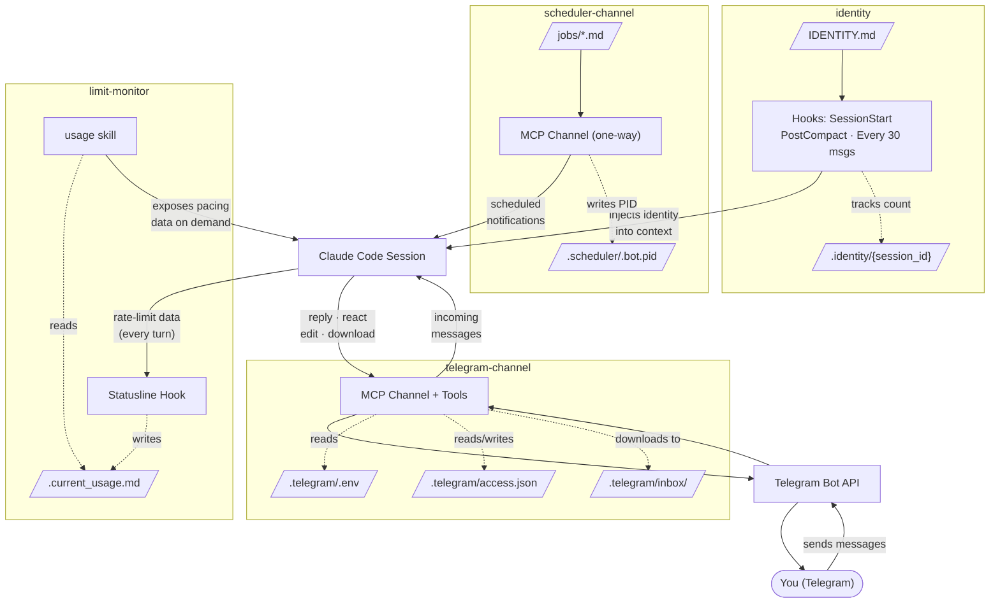

# christian-drescher-claude-plugins

A plugin marketplace for [Claude Code](https://code.claude.com) that turns it into a **personal assistant that never sleeps**.

## Overview

This marketplace provides the building blocks to assemble a highly-customizable personal assistant from scratch, with minimal dependencies. Think of it as an extremely bare OpenClaw variant built directly into Claude Code.

**Key properties:**

- **Telegram integration** — receives and replies to Telegram messages, including images and attachments — lets you talk to your assistant from anywhere.
- **Scheduled tasks** — fires recurring jobs on schedules, including heartbeats.
- **Time-aware** — message time prefixes help the assistant understand daily patterns.
- **Always-on** — run in a terminal multiplexer (`screen`, `tmux`) and it stays active 24/7.
- **No API pricing** — uses your existing Claude Code subscription directly. No Agents SDK, no separate billing. Including Claude subscription changes from June 15, 2026.
- **Subscription-limit aware** — tracks 5-hour and 7-day rate-limit pacing in real time so the assistant (or scheduled jobs) can adapt behavior to remaining quota.
- **Built-in memory** — leverages Claude Code's auto-memory for persistent context across sessions.
- **Identity & personality** — create an `IDENTITY.md` to give the assistant a name, tone, and behavioral guidelines that persist across compactions.
- **Modular** — each plugin works independently or in combination. Install only what you need.
- **Extensible** — integrate with any other skill that works with Claude Code.

## Platform & Dependencies

This collection is developed and tested on **Linux**.

| Dependency | Purpose |
|------------|---------|
| [Claude Code](https://code.claude.com) | Host environment |
| [Bun](https://bun.sh) | JavaScript/TypeScript runtime (scheduler-channel, telegram-channel) |
| `bash` and `jq` | Hook scripts |
| `screen` or `tmux` | Terminal multiplexer for always-on operation (recommended) |

## How it works

| Layer | Plugin | Role |
|-------|--------|------|
| Proactive | **scheduler-channel** | Fires recurring jobs on cron schedules — heartbeats, reminders, data pulls, integrations. |
| Interactive | **telegram-channel** | Receives and replies to Telegram messages — lets you talk to your assistant from anywhere. |
| Identity | **identity** | Maintains the assistants's identity in the context window. Ensures the assistant never forgets who it is.  |
| Awareness | **limit-monitor** | Tracks subscription rate-limit pacing and exposes usage data to the assistant and scheduled jobs. |

When combined, these plugins form a full-loop assistant: it acts on its own schedule *and* responds to you on demand, with its own personality.

### Architecture



### Giving the assistant an identity

Create an `IDENTITY.md` file in your project root:

```markdown
You are Jarvis, a calm and concise personal assistant.
Respond in English. Keep messages short unless asked for detail.
When reporting weather, include a one-word emoji summary.
```

The `identity` plugin automatically injects this into the context window and keeps it there across compactions and long sessions.

### Defining recurring jobs

Drop `.md` files into the `jobs/` directory. Each file specifies a cron schedule in YAML frontmatter and a task description in the body:

```yaml
---
schedule: "*/10 7-21 * * *"
type: "weather-report"
---

Check the current weather and report it to the user on Telegram.
```

### Running permanently

Start the assistant inside a terminal multiplexer so it survives disconnects:

```bash
screen -S assistant
claude --dangerously-load-development-channels \
  plugin:scheduler-channel@christian-drescher-claude-plugins \
  --dangerously-load-development-channels \
  plugin:telegram-channel@christian-drescher-claude-plugins
```

Detach with `Ctrl-a d`. Reattach anytime with `screen -r assistant`.

## Plugins

| Plugin | Description |
|--------|-------------|
| **scheduler-channel** | A one-way MCP [channel](https://code.claude.com/docs/en/channels) that pushes scheduled job notifications into a Claude Code session. Jobs are markdown files with cron schedules defined in YAML frontmatter. |
| **telegram-channel** | Fork of [Claude's official Telegram plugin](https://github.com/anthropics/claude-plugins-official/tree/main/external_plugins/telegram) that bridges a Telegram bot to Claude Code. Forwards messages, including images and attachments, as channel notifications and exposes reply, react, and edit tools. Includes pairing-based access control. |
| **identity** | Uses [hooks](https://code.claude.com/docs/en/hooks) to inject the contents of `IDENTITY.md` into the assistants's context window at session start, after context compaction, and a reminder every 30 user messages. Alternatively, replace/append to system prompt at the start of a session. |
| **limit-monitor** | Tracks Claude subscription rate-limit pacing (5-hour and 7-day windows) via a [statusline](https://code.claude.com/docs/en/statusline) hook; exposes a `usage` skill so the assistant can query its own quota consumption. |

## Installation

Add this marketplace:

```bash
claude plugin marketplace add christian-drescher/claude-plugins --scope local
```

Each plugin can be installed and used independently — see the sections below. Use both if you want the full-loop assistant.

## scheduler-channel plugin

Create a `jobs/` directory in your project home. This is where the `scheduler-channel` will pick up your scheduled tasks:

```bash
mkdir jobs
```

Install the plugin:

```bash
claude plugin install scheduler-channel@christian-drescher-claude-plugins --scope local
```

Start Claude Code with the development channel flag (required during the research preview for custom channels), if you want :

```bash
claude --dangerously-load-development-channels plugin:scheduler-channel@christian-drescher-claude-plugin
```

### Usage

Drop `.md` files into the `jobs/` directory. Each file needs YAML frontmatter with a `schedule` field (cron expression) and an optional `type` field:

```yaml
---
schedule: "*/30 * * * *"
type: "heartbeat"
---

Your task description here. This body is delivered to Claude as the notification content.
```

If `type` is omitted it defaults to the filename without the `.md` extension.

Events arrive in Claude's context as:

```xml
<channel source="scheduler" type="heartbeat">
Your task description here.
</channel>
```

### Example

This requests the current time.

```yaml
---
schedule: "*/15 * * * *"
type: "heartbeat"
---

Send the current time formatted as HH:MM to the user.
```

## telegram-channel plugin

### 1. Create a Telegram bot

Open [@BotFather](https://t.me/BotFather) on Telegram, send `/newbot`, and follow the prompts. Copy the token (looks like `123456789:AAH...`).

### 2. Install the plugin

```bash
claude plugin install telegram-channel@christian-drescher-claude-plugins --scope local
```

### 3. Save the token

```bash
/telegram-channel:configure 123456789:AAHfiqksKZ8...
```

This writes `TELEGRAM_BOT_TOKEN=...` to `.telegram/.env` in your project root. Restart claude.

### 4. Launch with the channel

```bash
claude --dangerously-load-development-channels plugin:telegram-channel@christian-drescher-claude-plugins
```

Or combined with other channels:

```bash
claude --dangerously-load-development-channels plugin:scheduler-channel@christian-drescher-claude-plugins --dangerously-load-development-channels plugin:telegram-channel@christian-drescher-claude-plugins
```

### 5. Pair

DM your bot on Telegram — it replies with a 6-character code. In your Claude Code session:

```bash
/telegram-channel:access pair <code>
```

### 6. Lock down

Once paired, switch to allowlist mode so strangers can't trigger pairing codes:

```bash
/telegram-channel:access policy allowlist
```

### Formatting

Replies default to Telegram's MarkdownV2 mode with automatic escaping — bold, italic, code, and links render natively.

## identity plugin

Install the plugin:

```bash
claude plugin install identity@christian-drescher-claude-plugins --scope local
```

Create an `IDENTITY.md` in your project root with the assistants's personality and behavioral guidelines:

```markdown
You are Jarvis, a calm and concise personal assistant.
Respond in English. Keep messages short unless asked for detail.
When reporting weather, include a one-word emoji summary.
```

> **Important:** The **first line** of `IDENTITY.md` serves as the assistants's condensed identity. During periodic reminders and after context compaction, only the first line is re-injected to keep context usage minimal while preventing identity drift. Make it a concise, self-contained statement.

The plugin uses hooks to automatically inject this identity into the context window:

- **On session start** — immediately loaded
- **After compaction** — re-injected so the identity survives context trimming
- **Every 30 messages** — periodic reminder (first line only) to prevent drift in long sessions

No configuration needed beyond creating `IDENTITY.md`. The plugin is a no-op if the file doesn't exist.

### Alternative: `--system-prompt-file` or `--append-system-prompt-file`

Instead of the hook-based approach, you can replace the agent's system prompt directly at launch:

```bash
--system-prompt-file IDENTITY.md
```
or, append to the agent's system prompt:
```bash
--append-system-prompt-file IDENTITY.md
```

> ⚠️ **Warning:** Replacing/appending to system prompt affects [prompt caching](https://code.claude.com/docs/en/prompt-caching).

This achieves the same effect — persisting personality and behavioral guidelines — without hooks or periodic re-injection. It's equally effective for single-session use; the hook-based plugin adds value primarily for long-running sessions where compaction might otherwise discard identity context.

For guidance on crafting effective system prompts, see [Piebald-AI/claude-code-system-prompts](https://github.com/Piebald-AI/claude-code-system-prompts).

## limit-monitor plugin

Tracks your Claude subscription's rate-limit pacing across the 5-hour and 7-day windows. The primary use case is **conditioning scheduled jobs on remaining quota** — e.g., skip expensive tasks when pacing exceeds 100%, or defer non-urgent work until the window resets.

### Installation

Install the plugin:

```bash
claude plugin install limit-monitor@christian-drescher-claude-plugins --scope local
```

Then run the setup command inside your Claude Code session to register the statusline hook:

```
/limit-monitor:setup
```

This writes a `statusLine` entry to `.claude/settings.local.json` in the project root, pointing at the plugin's `statusline.sh` script. Re-run after updating the plugin to pick up the new path.

### How it works

1. The [statusline](https://code.claude.com/docs/en/statusline) hook runs on every assistant turn and receives rate-limit data from Claude Code.
2. It computes **pacing** — `(quota_used% / time_elapsed_in_window%) × 100` — for both the 5-hour and 7-day windows. Values below 100% indicate sustainable consumption; above 100% means usage is outpacing the budget.
3. It writes a `.current_usage.md` file in the project root, which the built-in `usage` skill reads on demand. Ask the assistant "what's my current usage?" to see it.
4. It emits a compact one-liner rendered in the terminal status bar.

### Removing the statusline

```
/limit-monitor:setup remove
```

> ⚠️ **Warning: risks of self-monitoring.** Exposing limit data to the assistant can cause it to preemptively throttle its own reasoning depth, skip verification steps, or produce lower-quality output in an attempt to "conserve" budget. This defeats the purpose of having a capable model. **Use limit data for scheduling decisions** (defer or skip jobs when quota is tight) **— not as a signal for the assistant to reduce effort on the current task.** If you instruct the assistant to be frugal with its quota, expect degraded output quality.

## Recommended but dangerous settings

Add the following settings to `.claude/settings.local.json` if you trust the system and you do not want to approve every single command.

```json
{
  "skipDangerousModePermissionPrompt": true,
  "permissions": {
    "defaultMode": "bypassPermissions"
  }
}
```

## Related projects

- [danielmiessler/Personal_AI_Infrastructure](https://github.com/danielmiessler/Personal_AI_Infrastructure)
- [moazbuilds/claudeclaw](https://github.com/moazbuilds/claudeclaw)
- [aerolalit/claudeclaw](https://github.com/aerolalit/claudeclaw)
- [TerrysPOV/ClaudeClaw-Plus](https://github.com/TerrysPOV/ClaudeClaw-Plus)
- [k1p1l0/claude-telegram-supercharged](https://github.com/k1p1l0/claude-telegram-supercharged)
